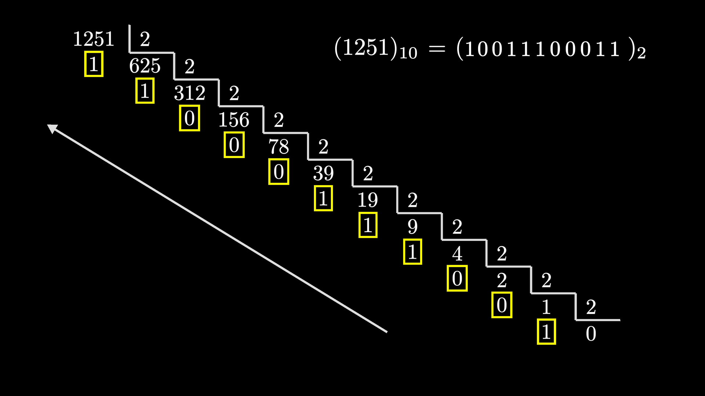
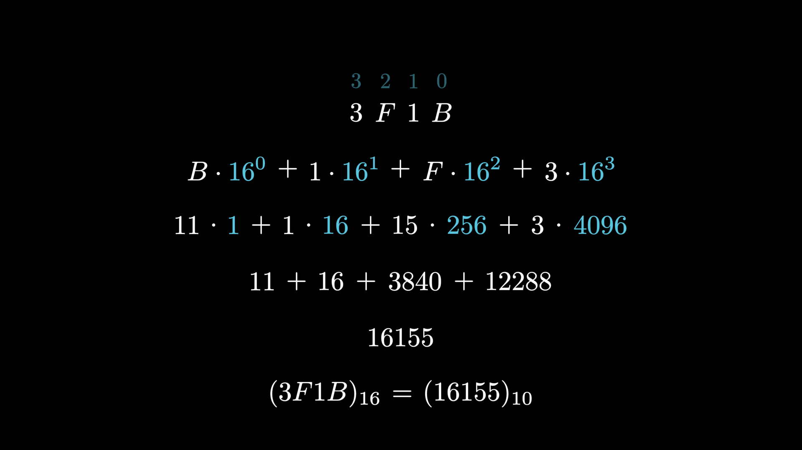
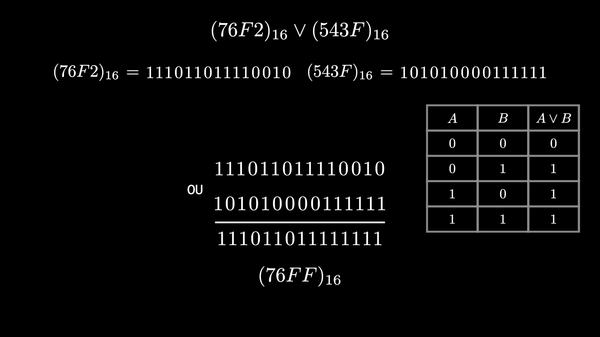
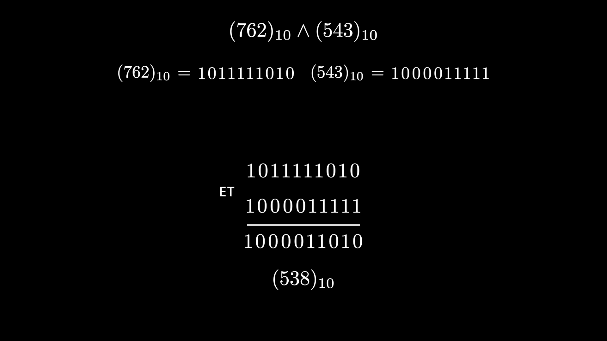
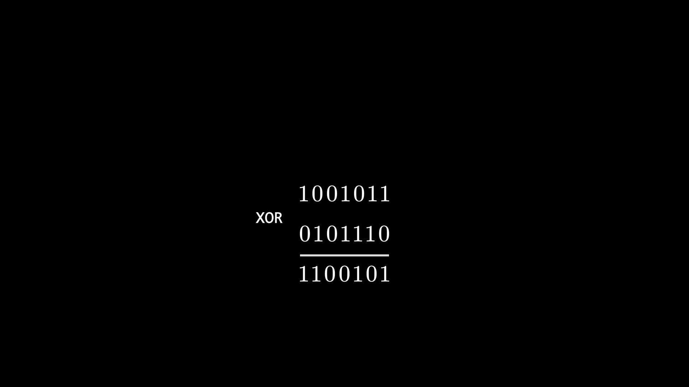

#  Base Converter (ManimGL)

A **visual base conversion tool** built with [ManimGL](https://github.com/3b1b/manim) to **demonstrate how integers are converted between different number bases** through engaging **animated visualizations**.

---

##  Features

-  Convert integers between **any bases (2–16)**  
-  **Step-by-step visual breakdown** of the division/remainder conversion method  
-  Supports **power-of-two bases** (2, 4, 8, 16)  
-  Includes **binary logic operations**: `AND`, `OR`, `XOR`  
-  Uses **ManimGL animations** for clear and intuitive demonstrations  

---

##  Requirements

- **Python 3.8+**
- **[ManimGL](https://github.com/3b1b/manim)**
- **LaTeX compiler:** [MikTeX](https://miktex.org/download)
- *(Optional)* [virtualenv](https://pypi.org/project/virtualenv/)

### Installation

```bash
pip install manimgl
```

## ⚙️ Setup

1. Clone the repository:

```bash
git clone https://github.com/5ache3/base-convertor.git
cd base-convertor
```


##  Usage
The main conversion logic is implemented in `main.py`.
You can call the function:
```py
convert(number, from_base, to_base, animate=True, **options)
 ```

### Example

```py
convert(1251, 10, 2, animate=True)
```
### Output (Example Animation)
<video width="600" controls>
  <source src="assets/1251-B10_to_B2.mp4" type="video/mp4">
  Your browser does not support the video tag.
</video>

```py
convert(1251, 10, 2, animate=False)
```
### Output :



```py
convert("3F1B",16,10,animate=False)
```
### Output :




## ■ Logic Operations Examples
```py
logic_operation("76F2","543F",16,"OR",animate=False)
```
### Output :
    


```py
logic_operation("762","543",10,"AND",animate=False,show_table=False)
```
### Output :
    


```py
logic_operation("101101","110011",2,"XOR",animate=False,show_table=False)
```
### Output :
    



##  Inspiration
Created to help students and educationers to visualize base conversion algorithms and binary logic in an intuitive and interactive way 

**Made with love for math, logic, and visualization 🙃.**